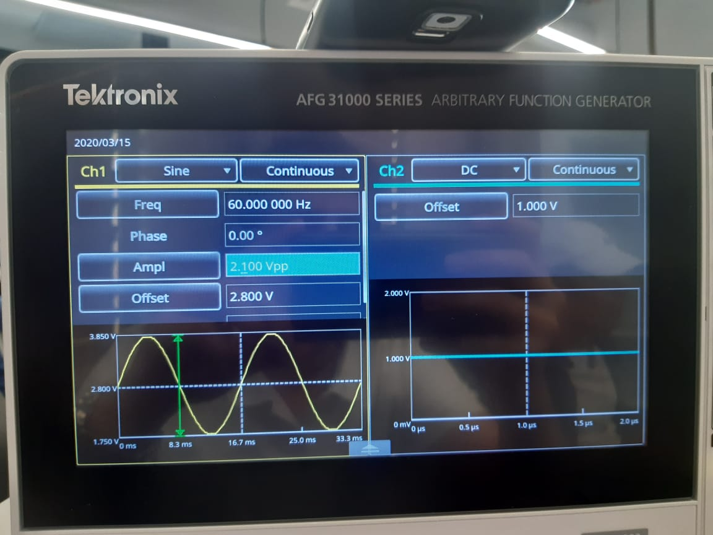

# Medición de calidad de energía de un inversor sincronizado con la línea comercial
Para este proyecto se realiza el diseño e implementación de un  inversor sincronizado con la línea comercial.

__Aplicaciones:__  
* Fuente de poder ininterrumpida.  
* Red de energía.  
* Paneles solares.

## Como características funcionales de este proyecto se tienen:

* __Inversor__
    * Vo = 9 VRMS  ± 2%
    * Fo = 60 Hz ± 5%
    * Po = 15W
* __Sincronización__
    * Enganche Fo = 60 Hz ± 5% (57 Hz – 63 Hz)
* __Medición de calidad__
    * Medición con módulo de adquisición
    * Acondicionamiento  de entrada de voltaje y corriente.
    * Rango dinámico de 80 dB
    * Variables a medir Vo (RMS), Io (RMS) y THD para estas.

## Equipo electrónico utilizado en este proyecto

  

## Diagrama Bloques proyecto

  

## Acondicionamiento línea comercial  
Reducir el voltaje de 120 VRMS AC de la línea a un voltaje no mayor a 9 VRMS AC.
Proporcionar la señal cuadrada al PLL para que este funcione correctamente.

## Circuito Inversor Esquemático  

  

## Circuito PLL  
Debe sincronizar la salida del inversor con la línea comercial acondicionada.  
Capacidad de enganchar una señal a la línea en un rango de +- 3 Hz.

  
  

## Circuito VCO - Generador onda seno  

  

## PCB del Proyecto  

  
  

